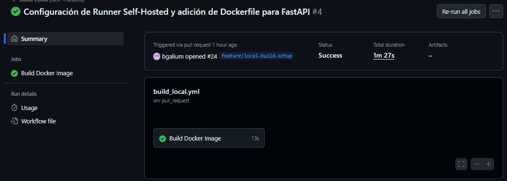

Evidencia del Sprint 2: https://1drv.ms/f/c/fdb226ef3c2e079a/IgDEEeuIV_wpRqjahXv3j7hHAW9fVQRgpbRoINibczd-0o4

## Historia 1: Configuración del Self-Hosted Runner

ID: #16 ID_PULL_REQUEST: #20

Descripción: Instalar y registrar un agente "runner" de GitHub en la máquina local (o VM de laboratorio) para permitir la ejecución de trabajos que requieren acceso a infraestructura local (Docker).

Tareas:
 Descargar el paquete del runner de GitHub Actions para el sistema operativo local (Linux/Mac/Windows).
 Registrar el runner en el repositorio usando el token proporcionado por GitHub (Settings > Actions > Runners).
 Asignar las etiquetas (labels) obligatorias durante la configuración: self-hosted y local-docker.
 Iniciar el servicio del runner (interactivamente con ./run.sh o como servicio background).
 Verificar conexión sin usar credenciales externas (PATs).

Criterios de Aceptación:
 El runner aparece con estado "Idle" (Verde) en la configuración del repositorio en GitHub.
 El runner tiene visible la etiqueta personalizada local-docker.

EVIDENCIA: Ubicado en self-hosted.log ejecución de ./run.sh
``` bash
√ Connected to GitHub

Current runner version: '2.329.0'
2025-12-04 05:13:21Z: Listening for Jobs


```


Responsable(s): Serrano Max

## Historia 2: Documentación de Riesgos y Mitigaciones

ID: #19 ID_PULL_REQUEST: #21

Descripción:
Documentar los riesgos de seguridad inherentes al uso de self-hosted runners, específicamente en repositorios públicos o con múltiples colaboradores, y establecer las reglas para mitigarlos.

Tareas:

Actualizar sección en README.md.
Explicar el riesgo de persistencia: "Qué pasa si un PR malicioso se ejecuta en mi máquina" (acceso a red local, sistema de archivos, etc.).
Documentar estrategias de mitigación implementadas o recomendadas:
   Explicar buena práctica, uso de branch protection rules.
   Configuración de aprobación para colaboradores externos.
   Limpieza de entorno post-ejecución.

Criterios de Aceptación:

    El riesgo está explicado en README.md o implementado en un archivo (colocar en README.md la ubicación del archivo asociado).
    Se explican claramente al menos 2 riesgos y 2 mitigaciones.
EVIDENCIA:	[commit 2cf7af9ad8f1a5e66cb7f8622a7e028105bf6c0b](https://github.com/MjsaMax/Proyecto_3_Runner_Factory__orquestando_GitHubhosted_y_selfhosted_de_forma/pull/21/files)


Responsable(s): Serrano Max

## Historia 3: Orquestación de CI en Runner Local

**ID:** #17
**ID_PULL_REQUEST:** #24

Descripción:
Crear y configurar el flujo de trabajo (Workflow) de GitHub Actions para automatizar la construcción de la imagen Docker utilizando la infraestructura local (Self-Hosted Runner) previamente configurada. El objetivo es validar la arquitectura híbrida permitiendo que el código se compile en la máquina del equipo en lugar de la nube.

Tareas:
* Crear el archivo .github/workflows/build_local.yml.
* Configurar los triggers para detectar cambios en todas las ramas.
* Definir el job para ejecutarse específicamente en runners con las etiquetas self-hosted y local-docker.
* Integrar los pasos de checkout y docker build en el pipeline.

Criterios de Aceptación:
* El workflow se dispara automáticamente al hacer un git push.
* El estado del Workflow en la pestaña "Actions" finaliza en Success (Verde).
* Se verifica que la imagen Docker fue creada en la máquina host.

EVIDENCIA: Captura del Workflow exitoso en GitHub Actions.

Responsable(s): Poma Walter

---

## Historia 2: Dockerización de API  y Corrección de Build

**ID:** #24 
**ID_PULL_REQUEST:** #24

Descripción:
Solucionar el error crítico de construcción ("failed to read dockerfile") implementando un Dockerfile .

Tareas:
* Crear el archivo Dockerfile en la raíz del proyecto.
* Seleccionar una imagen base ligera (python:3.10-slim).
* Configurar la instalación de dependencias desde requirements.txt.


Criterios de Aceptación:
* El paso "Build Docker Image" en GitHub Actions no arroja el error "no such file or directory".
* El contenedor se construye exponiendo el puerto 8000 correctamente.
* El log muestra la instalación exitosa de librerías (FastAPI, Uvicorn).

EVIDENCIA: Log de ejecución exitosa del paso "Build Docker Image"

```bash
# Log extract from GitHub Actions Runner
Step 1/6 : FROM python:3.10-slim
 ---> ...
Step 4/6 : RUN pip install --no-cache-dir -r requirements.txt
 ---> Running in ...
Successfully installed fastapi-0.100.0 uvicorn-0.23.0 ...
Step 6/6 : CMD ["uvicorn", "app.main:app", "--host", "0.0.0.0", "--port", "8000"]
 ---> Running in ...
Successfully built docs-registry-api:local
```
---


## Historia 4: Integración de Seguridad y SBOM

**ID:** #18

Descripción:
Extender el pipeline local para incluir escaneo de vulnerabilidades y generación de la lista de materiales de software (SBOM), guardando los resultados como evidencia en la carpeta local .evidence/.

Tareas:
* Editar el archivo build_local.yml.
* Añadir paso para escaneo de vulnerabilidades con Trivy (apuntando a la imagen construida).
* Añadir paso para generación de SBOM con Syft.
* Configurar ambos pasos para redirigir la salida (output) a archivos dentro de la carpeta .evidence/.

Criterios de Aceptación:
* El pipeline no falla (o falla controladamente con exit-code 0 según configuración).
* La carpeta .evidence/ en el runner local contiene los reportes generados tras la ejecución.

EVIDENCIA: Log de ejecución local de Trivy y generación de reportes JSON.

```bash
# Ejecución local de Trivy (Pre-validación)
2025-12-05T00:44:15Z    INFO    Detected OS     family="debian" version="13.1"
2025-12-05T00:44:15Z    INFO    [debian] Detecting vulnerabilities...   os_version="13" pkg_num=87
2025-12-05T00:44:15Z    INFO    Number of language-specific files       num=1
2025-12-05T00:44:15Z    INFO    [python-pkg] Detecting vulnerabilities...

# Verificación de archivos generados
$ ls -lh .evidence/
total 64K
-rw-r--r-- 1 aaron aaron  45K Dec  4 19:44 sbom.json
-rw-r--r-- 1 aaron aaron  15K Dec  4 19:44 trivy-report.json
```
Responsable(s): Davila Aaron
